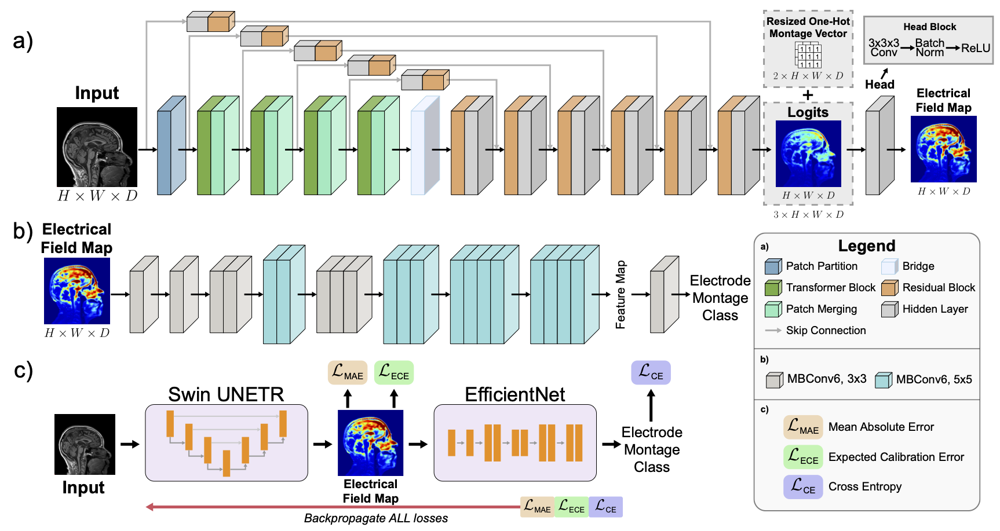

# Towards tDCS Digital Twins using Deep Learning-based Direct Estimation of Personalized Electrical Field Maps from T1-Weighted MRI

Transcranial Direct Current Stimulation (tDCS) is a non-invasive brain stimulation method that applies neuromodulatory effects to the brain via low-intensity, direct current. It has shown possible pos- itive effects in areas such as depression, substance use disorder, anxiety, and pain. Unfortunately, mixed trial results have delayed the field’s progress. Electrical current field approximation provides a way for tDCS researchers to estimate how an individual will respond to specific tDCS parameters. Publicly available physics-based stimulators have led to much progress; however, they can be error-prone, susceptible to quality issues (e.g., poor segmentation), and take multiple hours to run. Digital functional twins provide a method of estimating brain function in response to stimuli using computational methods. We seek to implement this idea for individualized tDCS. Hence, this work provides a proof-of-concept for generating electrical field maps for tDCS directly from T1-weighted magnetic resonance images (MRIs). Our deep learning method employs special loss regularizations to improve the model’s generalizability and calibration across individual scans and electrode montages. Users may enter a desired electrode montage in addition to the unique MRI for a custom output. Our dataset includes 442 unique individual heads from individuals across the adult lifespan. The pipeline can generate results on the scale of minutes, unlike physics-based systems that can take 1-3 hours. Overall, our methods will help streamline the process of individual current dose estimations for improved tDCS interventions.

## Paper
This repository provides the official implementation of training and evaluation of the model as described in the following paper:

**Towards tDCS Digital Twins using Deep Learning-based Direct Estimation of Personalized Electrical Field Maps from T1-Weighted MRI**

Skylar E. Stolte<sup>1</sup>, Aprinda Indahlastari<sup>2,3</sup>, Alejandro Albizu<sup>2,4</sup>, Adam J. Woods<sup>2,3,4</sup>, and Ruogu Fang<sup>1,2,5*</sup>

<sup>1</sup> J. Crayton Pruitt Family Department of Biomedical Engineering, Herbert Wertheim College of Engineering, University of Florida (UF), USA<br>
<sup>2</sup> Center for Cognitive Aging and Memory, McKnight Brain Institute, UF, USA<br>
<sup>3</sup> Department of Clinical and Health Psychology, College of Public Health andHealth Professions, UF, USA<br>
<sup>4</sup> Department of Neuroscience, College of Medicine, UF, USA<br>
<sup>5</sup> Department of Electrical and Computer Engineering, Herbert Wertheim College ofEngineering, UF, USA<br>

International Conference on Medical Image Computing and Computer Assisted Intervention (MICCAI) 2024<br>
[paper](TO BE ADDED) | [code]https://github.com/lab-smile/tDCS-DT | [poster](TO BE ADDED)

## Major results from our work

- Custom dataset of T1-weighted MRIs and tDCS current maps for 442 individual heads across the lifespan
- Dual training system and loss regularization that also incorporates calibration
- Proof-of-concept results for the generation of tDCS current estimations directly from MRIs using deep learning

<div align="center">
	
</div>

<div align="center">
  <b>fig. 1:</b> Method Pipeline.<br>
</div>
<br>

## Usage

### Data Preparation
[Text]

### Conda Environment
[Text]

### Training
[Text]
```
[Code Block]
```
[Text]

### Testing
[Text] 
```
[Code Block]
```
[Text]

## Acknowledgement

This work was supported by the National Institutes of Health/National Institute on Aging (NIA RF1AG071469, NIA R01AG054077), the National Science Foundation (1842473, 1908299, 2123809), the University of Florida McKnight Brain Institute, the University of Florida Center for Cognitive Aging and Memory, and the McKnight Brain Research Foundation. 

Source Networks - 

SwinUNETR:
https://arxiv.org/abs/2201.01266
https://github.com/Project-MONAI/research-contributions/tree/main/SwinUNETR

EfficientNet:
https://arxiv.org/pdf/1905.11946
https://github.com/lukemelas/EfficientNet-PyTorch

## Contact
For any discussion, suggestions and questions please contact: [Skylar Stolte](mailto:skylastolte4444@ufl.edu), [Dr. Ruogu Fang](mailto:ruogu.fang@bme.ufl.edu).

*Smart Medical Informatics Learning & Evaluation Laboratory, Dept. of Biomedical Engineering, University of Florida*